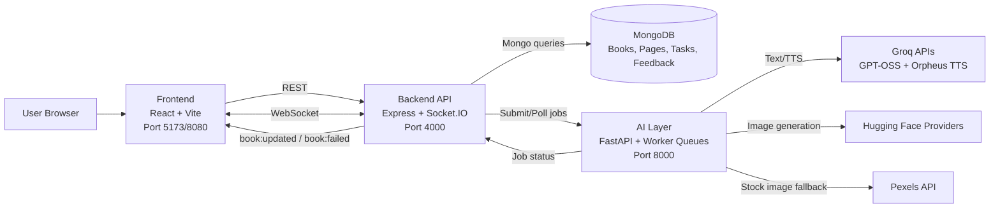
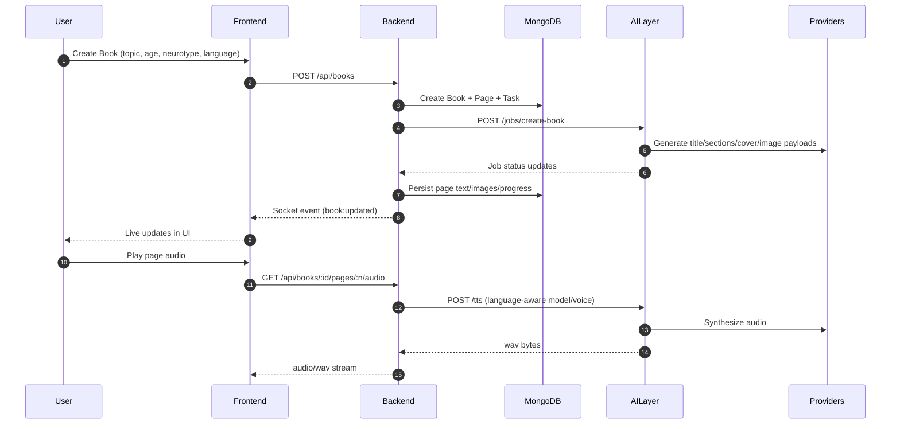
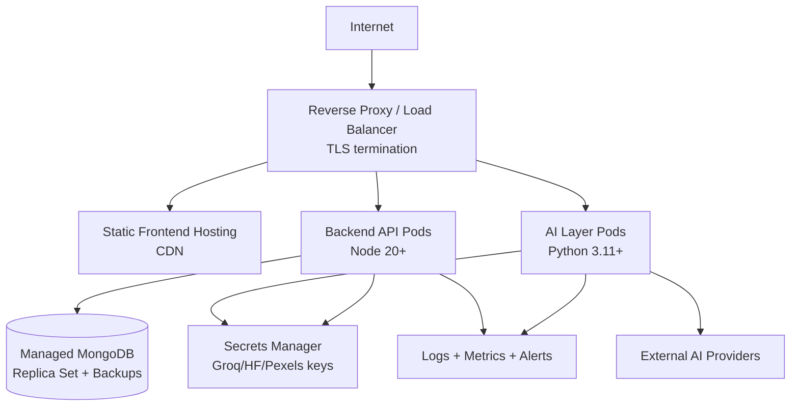

# Interactive Book Architecture

This document contains production-oriented architecture diagrams for the Interactive Book platform.

## System Architecture (Mermaid)

## Generation Flow (Mermaid Sequence)

## Deployment Topology (Recommended)

## Key Production Notes

- Keep backend and AI layer independently scalable.
- Use sticky-free WebSocket setup or a shared pub/sub adapter when horizontally scaling backend.
- Add rate limiting and auth before public launch.
- Store secrets in a vault/secret manager, never in repo files.
